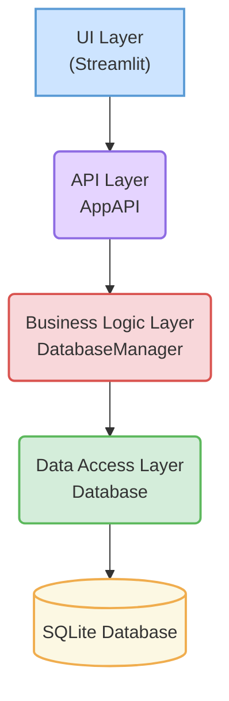

```markdown
# Developer's Guide: Kranos MMA Reporter
**Version:** 1.1  
**Last Updated:** 2025-06-13

---

## 1. Introduction
This document provides all the technical information required for a developer to set up the development environment, understand the project architecture, and contribute to the Kranos MMA Reporter application. Adhering to these standards is mandatory to ensure code quality, maintainability, and consistency across the project.

---

## 2. Getting Started

### 2.1. Initial Setup
Follow these steps to get the application running on your local machine.

**Clone the Repository:**
```bash
git clone <repository-url>
cd salaries
```

**Create and Activate a Virtual Environment:** This isolates the project's dependencies.
```bash
# For Unix/macOS
python3 -m venv venv
source venv/bin/activate

# For Windows
python -m venv venv
.\venv\Scripts\activate
```

**Install Dependencies:** The `requirements.txt` file contains all necessary packages to run, test, and develop the application.
```bash
pip install -r requirements.txt
```

### 2.2. Updated requirements.txt
The project requires the following packages. Ensure your `requirements.txt` file matches this list:
```
# Application Framework
streamlit

# Data & Excel Handling
pandas
openpyxl

# Code Quality & Formatting
black
flake8
```

### 2.3. Running the Application
The user interface is built with Streamlit. To launch the application, run the following command from the root `salaries` directory:
```bash
streamlit run reporter/streamlit_ui/app.py
```

### 2.4. Running Tests
The project includes a suite of tests to validate business logic and data integrity. Run all tests using the provided shell script:
```bash
# Ensure the script is executable
chmod +x run_all_tests.sh

# Run tests
./run_all_tests.sh
```

---

## 3. Project Architecture
The application uses a 4-layer decoupled architecture. This separation of concerns makes the application easier to test, maintain, and scale. It is critical that you respect these boundaries.



- **UI Layer (`streamlit_ui/`):** Responsible for rendering the user interface. It should only communicate with the API Layer. It must not contain any business logic.
- **API Layer (`app_api.py`):** Acts as a simple, formal bridge. It exposes the application's functionality to the UI. Its methods should only call the Business Logic Layer.
- **Business Logic Layer (`database_manager.py`):** Contains all the core application logic, rules, and calculations (e.g., how to add a member, how to calculate renewals). It orchestrates calls to the Data Access Layer.
- **Data Access Layer (`database.py`):** Contains the raw SQL queries. It is the only layer that directly interacts with the database.

---

## 4. Development Standards

### 4.1. Code Style & Quality
- **Formatting:** All Python code must be formatted with `black`. Run `black .` before committing changes.
- **Linting:** All code must pass `flake8` checks with no errors. Run `flake8 .` before committing.
- **Docstrings and Comments:** Provide clear docstrings for all modules, classes, and functions. Use comments to explain complex or non-obvious sections of code.

### 4.2. Git Branching Strategy
We use a simple feature-branching workflow:
1. Create a new branch from the `main` branch for your feature or bugfix (e.g., `feature/add-reporting-tab` or `fix/member-search-bug`).
2. Commit your work to this branch.
3. Once complete and tested, open a Pull Request to merge your branch back into `main`.

### 4.3. Naming Conventions & Code Patterns
To ensure consistency, all code must follow these PEP 8-inspired conventions.
- **Variables & Functions:** Use `snake_case`.
  - *Example:* `active_members = get_active_members()`
- **Classes:** Use `PascalCase`.
  - *Example:* `class DatabaseManager:`
- **Constants:** Use `UPPER_SNAKE_CASE`.
  - *Example:* `DEFAULT_RATE = 100`
- **"Private" Members:** For internal methods or attributes within a class that should not be used externally, prefix them with a single underscore `_`.
  - *Example:* `self._execute_query(...)`
- **Type Hinting:** Use type hints for function signatures to improve clarity and enable static analysis.
  - *Example:* `def get_member_by_id(self, member_id: int) -> dict | None:`
- **Context Managers:** Always use the `with` statement when working with resources like files or database connections to ensure they are properly closed.
  - *Example:* `with open('report.txt', 'w') as f:`
- **String Formatting:** Use f-strings for all string formatting needs. They are more readable and performant.
  - *Example:* `message = f"Welcome, {member_name}!"`

---

## 5. Contribution Workflow
To add a new feature or modify an existing one, you must work through the layers of the architecture.

**Example: Adding a feature to "Update a Member's Phone Number"**

1.  **Data Access Layer (`database.py`):**
    - Add a new method `update_member_phone(member_id, new_phone)` that contains the `UPDATE members SET phone = ? WHERE id = ?` SQL query.

2.  **Business Logic Layer (`database_manager.py`):**
    - Add a new method `update_member_phone(member_id, new_phone)`.
    - This method will contain any necessary validation logic (e.g., check if the phone number format is valid).
    - It will then call `self.db.update_member_phone(...)` from the Data Access Layer.

3.  **API Layer (`app_api.py`):**
    - Add a pass-through method `update_member_phone(member_id, new_phone)` that simply calls `self.db_manager.update_member_phone(...)`.

4.  **UI Layer (`streamlit_ui/app.py`):**
    - Add the necessary Streamlit widgets (e.g., a text input and a button) to the UI.
    - The button's `on_click` handler will call `api.update_member_phone(...)` with the data from the UI.

---

## 6. Database Management
The database schema is defined in `database.py` within the `Database` class's `__init__` method.

If a schema change is required (e.g., adding a new column), a formal migration plan must be developed. For now, manual changes are acceptable for this early stage, but we will move to a scripted migration tool (like Alembic) if the application complexity grows.
```